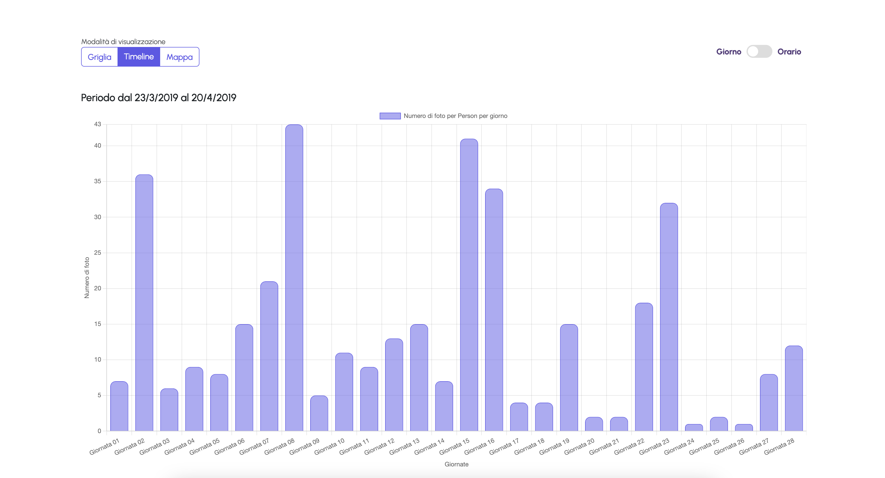
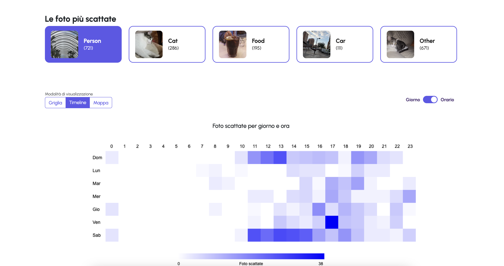
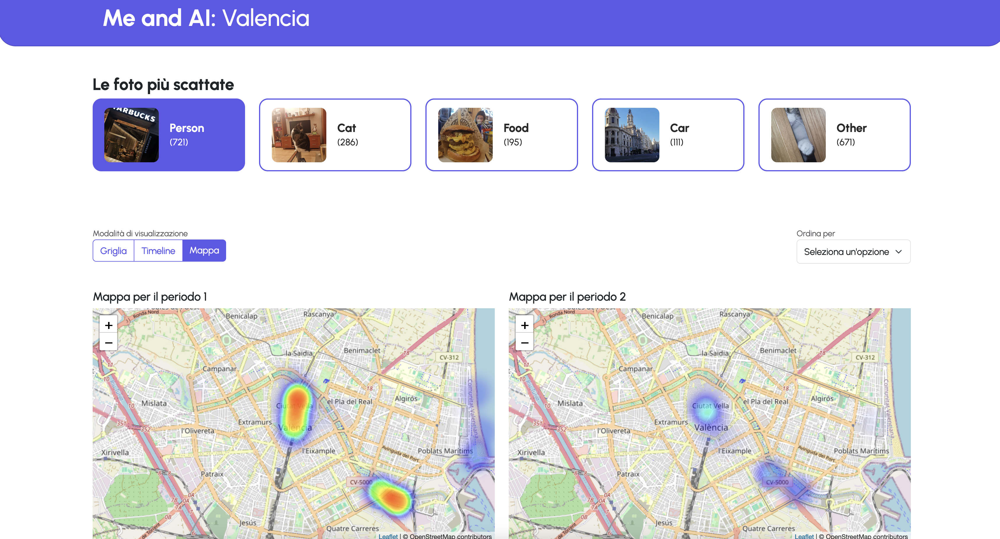
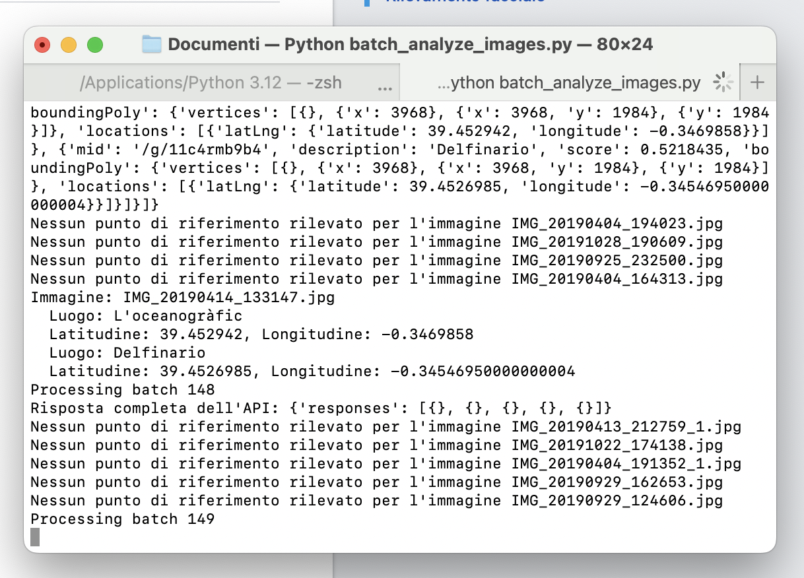

SUPSI 2023-24  
Corso d’interaction design, CV428.01  
Docenti: A. Gysin, G. Profeta  

Elaborato 2: XL 

# ExplorAI: Valencia
Autore: Walter De Nicola<br>
[ExplorAi](https://walterdn03.github.io/explorai#)<br>
[Video](https://walterdn03.github.io/documentazione/registrazione.mov#)


## Introduzione e tema
Il seguente progetto utilizza diversi algoritmi di machine learning, tra cui Data Yolo, Exif e il landmark detect di Google (Cloud Vision) per realizzare un'interfaccia che mostri gli elementi chiave della mia vacanza a Valencia. Attraverso l'analisi e la gestione dei dati l'utente finale può esplorare la vacanza, con alcune interessanti statistiche.


## Riferimenti progettuali
Per lo sviluppo del progetto ho integrato alcune conoscenze apprese in classe, e indagando alcuni aspetti legati alla user experience e alla gestione dei filtri/modalità di ordinamento.


## Design dell’interfaccia e modalità di interazione
L'interfaccia utente è progettata per offrire un'esperienza semplice e intuitiva, consentendo agli utenti di esplorare visivamente le foto scattate nel periodo trascorso a Valencia. L'interfaccia non valorizza solo le foto, ma attraverso le differenti modalità evidenzia i cambiamenti e i pattern tra i due periodi.

**Modalità di visualizzazione e interazione**<br>
Gli utenti possono navigare tra tre modalità di visualizzazione principali: Griglia, Timeline e Mappa. La modalità Griglia mostra tutte le foto selezionate in un formato compatto e ordinato. Gli utenti possono ordinare le foto per più recente, meno recente o casuale, utilizzando il menu a tendina sulla destra.<br>


Nella modalità Timeline, gli utenti possono vedere le statistiche legate alla categoria selezionata, alternando tra una visualizzazione basata sui giorni e una oraria, con la possibilità di fare un confronto tra i due periodi di Valencia. La visualizzazione giornaliera presenta il numero di foto scattate per ciascun giorno, mentre la visualizzazione oraria utilizza una heatmap per mostrare l'attività fotografica distribuita per ora del giorno e giorno della settimana. Un interruttore permette di passare facilmente tra queste due sottoviste.
<br>



La modalità Mappa offre invece una rappresentazione geografica delle foto con coordinate GPS, visualizzate su mappe di calore per i due periodi distinti. Questo permette di evidenziare le aree di Valencia maggiormente frequentate durante i due periodi. Gli utenti possono esplorare queste mappe per osservare visivamente in quale zona sono state scattate più fotografie.


Una caratteristica chiave dell'interfaccia è la capacità di filtrare le foto per categoria, organizzandole automaticamente in base al numero di foto. Selezionando una categoria specifica, l'interfaccia aggiorna dinamicamente le visualizzazioni nelle diverse modalità (Griglia, Timeline e Mappa), permettendo agli utenti di esplorare facilmente i dati per la categoria scelta. 


## Tecnologia usata
Ho utilizzato diverse tecnologie per creare un'esperienza interattiva con diverse funzionalità.

**Caricamento e Visualizzazione delle Immagini**<br>
 Ogni immagine caricata nel progetto viene gestita da JavaScript, che determina come visualizzarla in modo ottimale. La funzione loadImages(data) viene utilizzata per aggiungere le immagini al DOM, assicurandosi che siano orientate correttamente e visualizzate con le giuste proporzioni.

```
function loadImages(data) {
  fotoContainer.innerHTML = '';
  data.forEach(fotoData => {
    const fotoDiv = document.createElement('div');
    fotoDiv.classList.add('foto');

    const img = document.createElement('img');
    img.src = `assets/images/foto/${fotoData.FileName}${fotoData.FileExtension}`;
    img.alt = 'Foto';
    img.onload = function() {
      if (img.naturalWidth > img.naturalHeight) {
        fotoDiv.classList.add('horizontal');
      } else {
        fotoDiv.classList.add('vertical');
      }
    };

    fotoDiv.appendChild(img);
    fotoContainer.appendChild(fotoDiv);
  });
}
```


**Filtraggio e Ordinamento delle Immagini**<br>
Le immagini vengono filtrate in base alla categoria selezionata. Ad esempio, se si seleziona "food", il codice verifica se le immagini contengono etichette alimentari predefinite. Inoltre, le immagini possono essere ordinate per data (più recenti o meno recenti) o in modo casuale.
```
function filterImages(label) {
  currentCategory = label;
  const filteredData = dataYolo.filter(item => {
    if (label === 'food') {
      return item.Objects.some(obj => foodLabels.includes(obj.label));
    } else if (label === 'other') {
      return item.Objects.some(obj => !topLabels.includes(obj.label) && !foodLabels.includes(obj.label));
    } else {
      return item.Objects.some(obj => obj.label === label);
    }
  });
  sortImages(filteredData);
  updateCategoryClasses(label);
}
```


**Conteggio e Ordinamento delle Categorie**<br>
Per ogni immagine, vengono contati gli oggetti appartenenti a ciascuna categoria. Le categorie sono poi ordinate in base al numero di immagini, mostrando prima quelle più popolari.

```
function generateCategories(data) {
  const labelCounts = {};
  const labelImages = {};
  let foodCount = 0;

  data.forEach(fotoData => {
    let uniqueLabels = new Set();

    fotoData.Objects.forEach(obj => {
      if (foodLabels.includes(obj.label)) {
        if (!uniqueLabels.has('food')) {
          foodCount++;
          uniqueLabels.add('food');
          if (!labelImages['food']) labelImages['food'] = [];
          labelImages['food'].push(fotoData);
        }
      } else {
        if (!uniqueLabels.has(obj.label)) {
          uniqueLabels.add(obj.label);
          labelCounts[obj.label] = (labelCounts[obj.label] || 0) + 1;
          if (!labelImages[obj.label]) labelImages[obj.label] = [];
          labelImages[obj.label].push(fotoData);
        }
      }
    });
  });

  if (foodCount > 0) {
    labelCounts['food'] = foodCount;
  }

  const sortedLabels = Object.keys(labelCounts).sort((a, b) => labelCounts[b] - labelCounts[a]);
  topLabels = sortedLabels.slice(0, 4);  // Le prime 4 categorie
}
```


**Visualizzazione delle Heatmap**<br>
Per la visualizzazione temporale delle immagini, vengono generate heatmap che mostrano la frequenza delle foto scattate per giorno e ora.
```

function createHeatmap(filteredData) {
  const canvas = document.getElementById('heatmapCanvas');
  const ctx = canvas.getContext('2d');
  const width = 24; // Numero di ore
  const height = 7; // Numero di giorni della settimana
  const marginSize = 60; // Spazio per le etichette
  const cellSize = 40; // Dimensione della cella

  canvas.width = width * cellSize + marginSize;
  canvas.height = height * cellSize + marginSize;

  const data = Array.from({ length: height }, () => Array(width).fill(0));

  filteredData.forEach(item => {
    const exifItem = exifData.find(exif => exif.FileName === item.FileName);
    if (exifItem) {
      const date = new Date(exifItem.CreateDate);
      const hour = date.getHours();
      const day = date.getDay();
      data[day][hour]++;
    }
  });

  const maxCount = Math.max(...data.flat());

  ctx.clearRect(0, 0, canvas.width, canvas.height);

  data.forEach((dayData, dayIndex) => {
    dayData.forEach((count, hourIndex) => {
      const intensity = (count / maxCount) * 255;
      ctx.fillStyle = `rgb(${255 - intensity}, ${255 - intensity}, 255)`;
      ctx.fillRect(marginSize + hourIndex * cellSize, marginSize + dayIndex * cellSize, cellSize, cellSize);
    });
  });

  const days = ['Dom', 'Lun', 'Mar', 'Mer', 'Gio', 'Ven', 'Sab'];
  days.forEach((day, index) => {
    ctx.fillStyle = '#000';
    ctx.font = '14px Arial';
    ctx.fillText(day, marginSize - 40, marginSize + index * cellSize + cellSize / 2 + 5);
  });

  for (let i = 0; i < 24; i++) {
    ctx.fillStyle = '#000';
    ctx.font = '14px Arial';
    ctx.fillText(i, marginSize + i * cellSize + cellSize / 2 - 5, marginSize - 10);
  }

  drawLegend(maxCount);
}
```


**Google Cloud Vision**<br>
Le posizioni delle immagini sono state generate utilizzando il servizio di machine learning di Google Cloud Vision, in particolare il Landmark Detection. Questo servizio ha identificato e associato automaticamente le coordinate GPS ai punti di riferimento visibili nelle immagini, rendendo possibile la mappatura precisa delle fotografie scattate.




## Target e contesto d’uso
Il progetto va pensato come uno strumento "aperto" in cui ognuno può utilizzare le proprie foto, per questo motivo il target sono gli utenti finali che hanno il desiderio di fare una sorta di "riassunto" di un proprio viaggio, indagando alcune caratteristiche che nascono grazie alle diverse modalità di visualizzazione.

